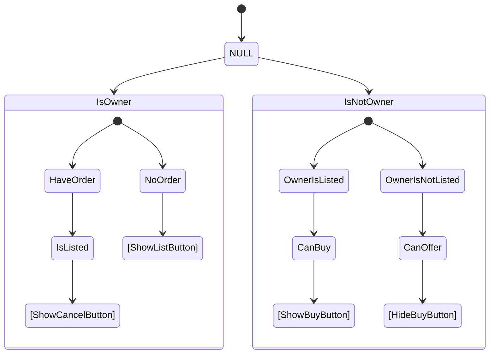

```mermaid
stateDiagram-v2
    [*] --> NULL
    NULL --> IsOwner
    NULL --> IsNotOwner

    state IsNotOwner {
        [*] --> OwnerIsListed 
        [*] --> OwnerIsNotListed 
        OwnerIsListed --> CanBuy
        CanBuy --> [ShowBuyButton]
        OwnerIsNotListed --> CanOffer
        CanOffer --> [HideBuyButton]
    }

    state IsOwner {
        [*] --> HaveOrder 
        [*] --> NoOrder
        HaveOrder --> IsListed
        IsListed --> [ShowCancelButton]
        NoOrder --> [ShowListButton]
    }
```
